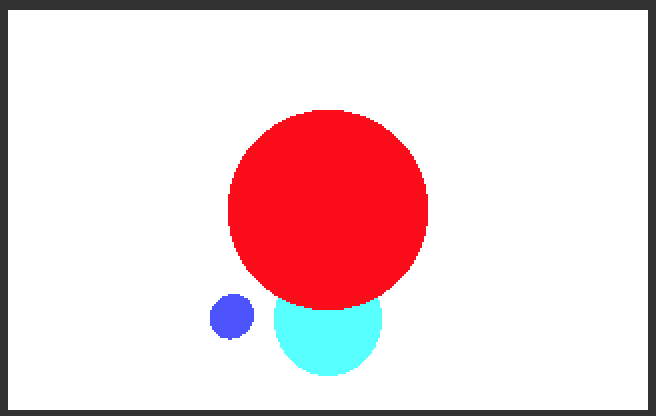

# pyray3d
An implementation of a 3D raytracer in python.

This is mostly a reaserch project to learn about raytracing.

##### Supports

* 💡 Point lighting
* ☀️  Ambient Lighting
* ➡️  Directional lighting
* 👥 shadows

##### TODO:

* ❀|❀ Reflection
* Diffuse lighting

